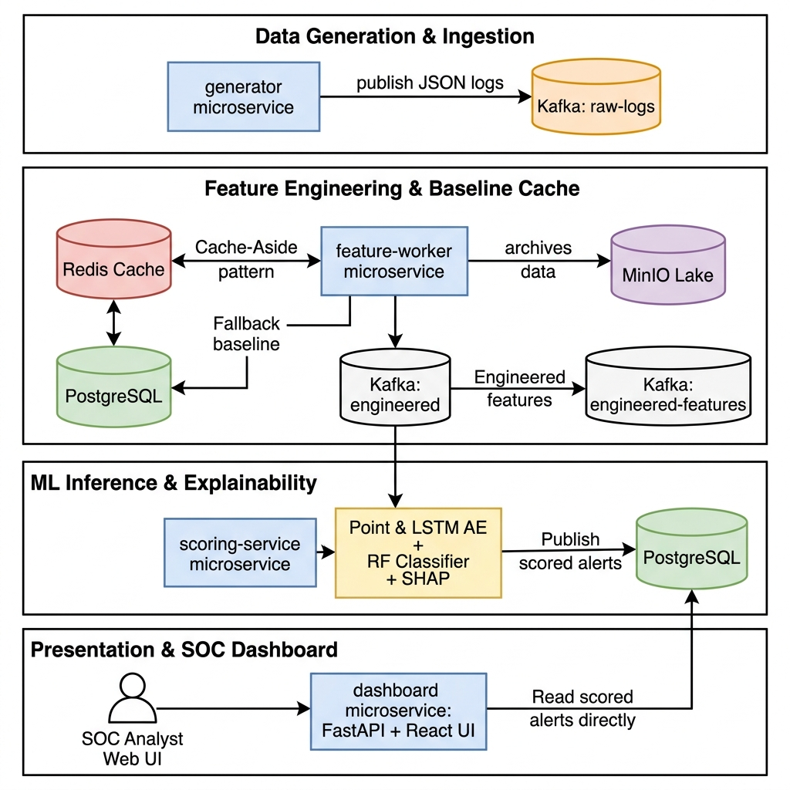
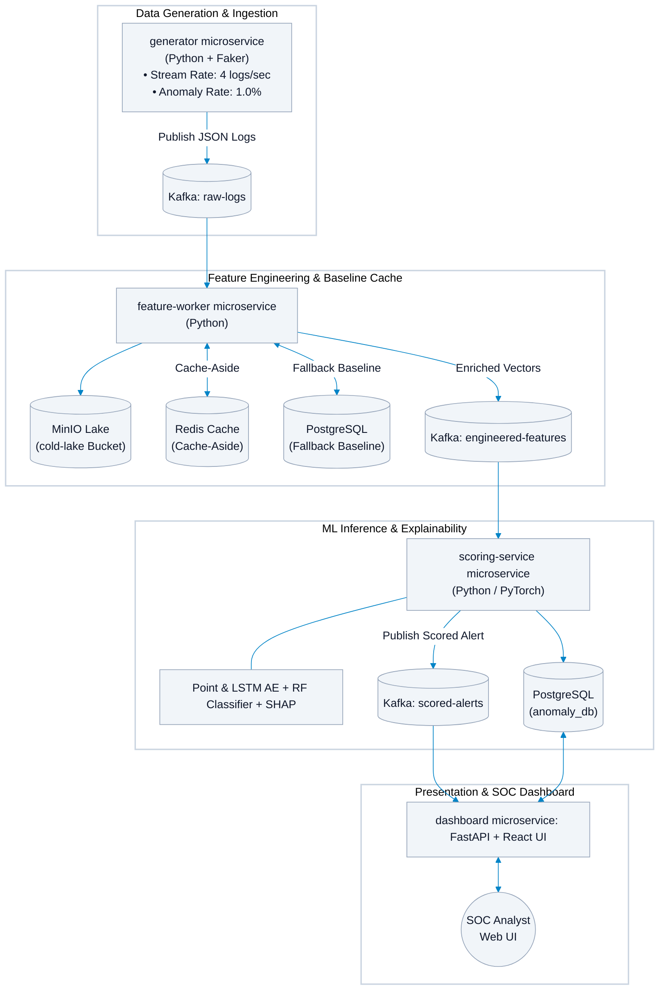

# 🛡️ AI-Powered Behavioral Anomaly Detection System (UEBA)

Real-Time User and Entity Behavior Analytics (UEBA) platform engineered to detect security threats, insider risks, and behavioral anomalies in enterprise log streams using **Apache Kafka**, **PyTorch Autoencoders**, **Random Forest Classifiers**, **SHAP Explainable AI (XAI)**, and **React 18**.

---

## 📐 System Architecture Diagram





---

## 🌟 Key Features

* **⚡ Real-Time Log Streaming**: Streams fresh, realistic enterprise access logs at **4 logs/second** with a calibrated **1.0% anomaly probability**.
* **🧠 Dual PyTorch Autoencoders**: Evaluates per-event reconstruction error using a **22-Dimensional Point Autoencoder** and a **5-Step Rolling Window LSTM Sequence Autoencoder**.
* **❄️ Cold-Start Role Peer Baseline Inheritance**: Solves the cold-start problem for newly onboarded employees or interns by inheriting aggregated peer profiles from their organizational role (`Intern / New Hire`, `Software Engineer`, `Executive`, etc.), auto-seeding PostgreSQL and Redis to eliminate Day-1 false alarms.
* **🔍 Explainable AI (SHAP TreeExplainer)**: Computes local feature attribution vectors for every security alert, showing SOC analysts exactly *why* an event was flagged.
* **🛡️ Interactive SOC Analyst Dashboard**: React 18 frontend with dynamic Light/Dark mode, real-time threat distribution pie charts, high-contrast taxonomy badges, and one-click **`✓ ACK`** alert resolution.

---

## ⚙️ Microservices Topology

| Container Service | Base Image / Technology | Description | Exposed Port |
| :--- | :--- | :--- | :--- |
| `ueba-generator` | Python 3.11 / Faker | Streams synthetic access logs to Kafka | Internal |
| `ueba-zookeeper` | Confluent ZooKeeper 7.5.0 | Manages Kafka cluster coordination | `2181` |
| `ueba-kafka` | Confluent Kafka 7.5.0 | Event streaming message broker | `9092` / `29092` |
| `ueba-feature-worker` | Python 3.11 / Redis | Extracts 22 deviation features & handles baselines | Internal |
| `ueba-redis` | Redis 7 Alpine | Cache-Aside profile lookup & rolling sets | `6379` |
| `ueba-scoring-service` | PyTorch / Scikit-Learn / SHAP | Performs deep learning anomaly scoring & XAI | Internal |
| `ueba-minio` | MinIO S3 Object Storage | Stores cold raw logs & ML model artifacts | `9000` / `9001` |
| `ueba-postgres` | PostgreSQL 15 Alpine | Persists alerts, entity baselines, & metrics | `5432` |
| `ueba-dashboard` | FastAPI / React 18 / Recharts | Serves REST endpoints, WebSockets, & UI | **`8000`** |

---

## 🛠️ Technology Stack

* **Languages**: Python 3.11, JavaScript (React 18 / ES6+), SQL, HTML5/CSS3
* **Frameworks & Web**: FastAPI, Uvicorn, React 18, Recharts, Lucide Icons
* **Machine Learning & XAI**: PyTorch, Scikit-Learn, SHAP, NumPy, Pandas
* **Messaging & Streaming**: Apache Kafka, Apache ZooKeeper
* **Databases & Storage**: PostgreSQL 15, Redis 7 (Cache-Aside), MinIO S3 Object Storage
* **Containerization**: Docker & Docker Compose

---

## 🚀 Quickstart & Execution Guide

### Prerequisites
* [Docker Engine](https://docs.docker.com/engine/install/) (v24.0+)
* [Docker Compose](https://docs.docker.com/compose/install/) (v2.20+)

### Running the System

1. **Clone the Repository**:
   ```bash
   git clone https://github.com/sohamkanhe/Honeywell-Behavioral-Anomaly-AI.git
   cd Honeywell-Behavioral-Anomaly-AI
   ```

2. **Start All Microservices**:
   ```bash
   docker-compose up -d --build
   ```

3. **Verify Container Status**:
   ```bash
   docker-compose ps
   ```

4. **Access the Dashboard**:
   Open your browser and navigate to:
   👉 **`http://localhost:8000`**

---

## 📜 License
Licensed under the [MIT License](LICENSE).
