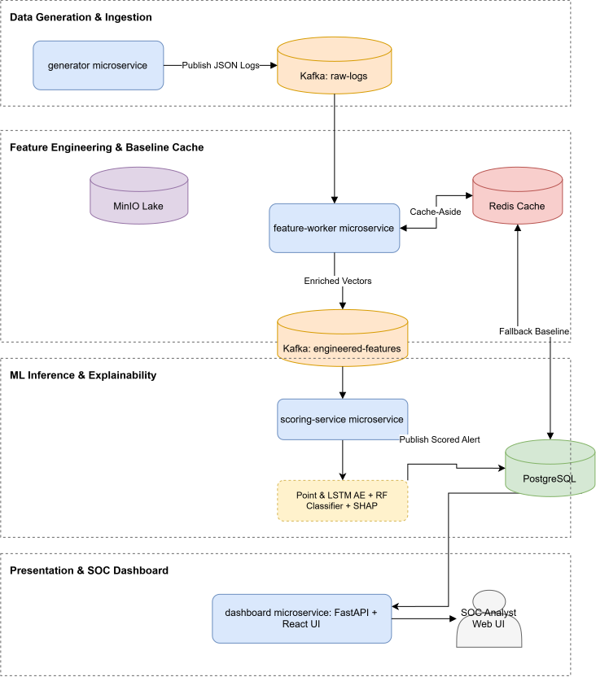

# 🛡️ AI-Powered Behavioral Anomaly Detection System (UEBA)

## 📐 System Architecture Diagram

### Microservices & Infrastructure Containers (As per System Architecture)
The system architecture consists of **8 core services and containers**:

1. **`generator microservice`**: Generates synthetic access logs and streams them to Kafka.
2. **`Kafka`**: Event streaming message broker hosting `raw-logs`, `engineered-features`, and `scored-alerts` topics.
3. **`feature-worker microservice`**: Consumes raw logs, performs feature engineering, interacts with Redis (Cache-Aside), PostgreSQL (Fallback Baseline), and archives data to MinIO Lake.
4. **`Redis Cache`**: In-memory cache for fast entity baseline lookups.
5. **`MinIO Lake`**: S3-compatible object storage for data archiving and model artifacts.
6. **`scoring-service microservice`**: Runs Point & LSTM Autoencoders, Random Forest Classifier, and SHAP TreeExplainer for anomaly scoring and explainability.
7. **`PostgreSQL`**: Relational database storing persistent alerts and fallback baselines.
8. **`dashboard microservice`**: FastAPI backend + React UI serving the SOC Analyst web interface.

---

## Part 1: Dataset Generation
**Entity setup.** 200 entities are created: 160 users distributed across 7 roles (Software Engineer, Finance & Accounting, Security & IT Admin, Executive, Marketing & Sales, General Admin, Intern/New Hire), 20 service accounts, and 20 edge devices. Each entity is assigned a fixed profile: a role-specific set of typical resources, auth methods, device fingerprints, command-sequence templates, and an IP pool. Each entity also gets a fixed base geo-location (lat/lon) and MAC address representing its "home" identity.

**Normal log generation.** The generator walks through 150 days, hour by hour. For each entity, at each hour, a role-specific activity-probability function decides whether that entity logs in during that hour (e.g. engineers peak mid-morning/afternoon on weekday-like patterns, security/service accounts stay flatter, executives are bursty/irregular). If activity is triggered, one event row is created by sampling from that entity's own profile: a resource, an auth method, a device, a command sequence, and a random session duration — all drawn from the entity's fixed pool, so the row looks consistent with that entity's normal role behavior. This produces ~195,000 label=normal rows.

**Anomaly injection.** On top of this, seven attack types are injected as separate rows, each targeting a role/entity type realistic for that attack (e.g. brute force → low-privilege roles, impossible travel → Executives, lateral movement → Engineers). Each attack instance is generated with randomized parameters — attempt counts, timing gaps, target resource, session duration, success/failure — instead of one fixed template, so no two instances of the same attack type are near-duplicates. Every injected row carries the true label (e.g. brute_force) and a deviation_source note, both used only for evaluation.

**Output.** All rows (normal + anomalies) are combined and sorted chronologically into one CSV with columns: entity_id, entity_type, role, timestamp, source_ip, geo_location, geo_lat, geo_lon, resource_accessed, auth_method, auth_result, session_duration_sec, command_sequence, device_fingerprint, mac_address, label, deviation_source.

---

## Part 2: Converting the Dataset into Features
The raw CSV isn't fed directly into any model — every row is first converted into a deviation-score feature vector: a set of numbers describing how unusual this event is relative to that entity's (or its role's) own history, not the raw categorical values themselves. This is what lets one shared model work across 200 very different entities.

**Step 1 — Time-based train/test split.** Rows before a cutoff date become the "train" period, rows after become "test." Only label == normal rows from the train period are used to build the reference baselines below — no anomaly data and no test-period data ever contributes to what "normal" means.

**Step 2 — Build reference baselines (frozen dictionaries, computed once from train-normal data):**
* `expected_commands[role]` — the set of commands that appear in at least 1% of that role's normal sessions
* `known_resources[entity_id]` (fallback: `[role]`) — the set of resources that entity/role normally accesses
* `known_devices[entity_id]` — the set of (device_fingerprint, MAC) pairs normally seen for that entity
* `duration_stats[entity_id]` (fallback: `[role]`) — mean/std of session duration
* `speed_stats[entity_id]` (fallback: `[role]`) — mean/std of implied travel speed between consecutive logins (using geo_lat/geo_lon + time gap, via haversine distance)
* `hour_hist[entity_id]` — histogram of what hours that entity normally logs in

**Step 3 — Compute deviation-score features per row, using the above baselines:**
* `command_novelty_score` — fraction of this row's commands that fall outside the entity's role's expected set
* `resource_novelty_score` — 0 if this resource is in the entity's (or role's) known set, else 1
* `device_novelty_score` — 0 if (fingerprint, MAC) matches a known pair for this entity, else 1
* `duration_zscore` — how many std devs this session's duration is from the entity's normal average
* `geo_velocity_zscore` — how many std devs the implied travel speed (vs. the previous event) is from normal
* `time_unusualness_score` — negative log-probability of this login hour, from the entity's hour histogram
* `hour_sin`, `hour_cos` — cyclical encoding of hour-of-day
* `recent_failed_auth_count` — rolling count of failed auths for this entity in the last 5 minutes (log-scaled)

Role and entity_type are also added as one-hot columns, so the model can condition on "who is this" alongside the deviation scores.

**Step 4 — Scale.** All numeric deviation features (excluding hard binary ones) are standardized using mean/std computed from train-normal data only, then applied unchanged to train-all and test data — avoiding any leakage from anomalous or future data into the scaling itself.

The result is `full_feature_df`: one row per event, each represented purely as a vector of "how deviant is this from what's expected," which is what actually gets fed into the autoencoders and classifiers.

---

## Part 3: Autoencoder + LSTM Sequence Model → Classification
**Point-wise autoencoder (Stage 1a).** Each event's deviation-score feature vector is fed individually into a feedforward autoencoder (encoder: Linear→ReLU→Linear→ReLU→Linear down to an 8-dim latent space; decoder: mirror of that). Trained only on label == normal rows, so it learns to reconstruct normal-looking deviation patterns well. At inference, the reconstruction error (MSE between input and output) is the anomaly score for that single event — this catches sharp, single-event anomalies (impossible travel, device spoofing) that don't depend on surrounding context.

**LSTM sequence autoencoder (Stage 1b).** To catch anomalies that only show up as a pattern over time (bursts, gradual drift, repeated low-volume access), events are grouped into sliding windows of 5 consecutive events per entity. An LSTM encoder reads the window step-by-step into a compressed hidden state; an LSTM decoder reconstructs the window from that state. Trained only on windows built entirely from normal rows. At inference, the max reconstruction error across the window's timesteps (not the mean) is used as the sequence anomaly score — this preserves sensitivity to a single sharp event inside an otherwise-normal window, rather than diluting it by averaging.

**Score combination and thresholding.** Both scores are percentile-ranked independently, then combined by taking the max of the two (either model alone can trigger an alert). A single tunable threshold percentile (e.g. top 2-5%) determines which events get flagged as alerts — this is the one number adjusted to trade off precision vs. recall for a realistic analyst alert budget.

**Stage 1 result:** at the chosen threshold, detection achieves **99.35% accuracy, 81.14% precision, 96.71% recall (F1 = 0.8824)** on the held-out test period — the detector catches the large majority of true anomalies, at the cost of a moderate false-positive rate, which is the expected and desired trade-off for a security alerting system (missing an attack is costlier than an analyst dismissing an extra alert).

**Stage 2 — anomaly-type classification.** Every flagged event is passed to a second-stage classifier (Decision Tree, Random Forest, Neural Network, and others), trained on the same deviation-score features but using only the anomaly-labeled rows, split by entity (not by row) to prevent near-duplicate leakage between train and test. This stage predicts which of the seven attack types a flagged event resembles.

**End-to-end result (Stage 1 detection → Stage 2 classification), Decision Tree:** **94.49% accuracy, 94.56% precision, 94.49% recall (F1 = 0.9449)**. Per-class performance shows genuine, explainable variation rather than uniform perfection: device_spoofing is classified perfectly (1.00 across the board, since its signature — mismatched device/MAC — is sharp and unambiguous), while impossible_travel (0.87 precision) and lateral_movement (0.86 precision) are harder, since their signatures more often overlap with other anomaly types or with legitimate behavioral variance (e.g. executives traveling internationally, engineers occasionally accessing new resources).
